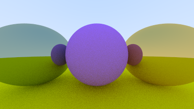
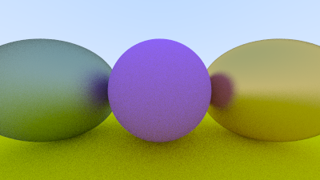

# RayTracing-in-OneWeekend
This repo is my implementation of RayTracing in One Weekend book.
## Platform  
---
- macOS, Linux, windows

## Dependency  
---
- g++ std=c++11
## How to run
---
- you can simply build with build.sh
```
./build.sh
```
- and you can get the result image image.ppm
## Feature
---
A simple raytracer from scratch, starting from a output of a pure color image, I built a simple vector computation library, defined classes for ray, hittable objects, materials(lambertian, dielectric, metal), etc.
## Result
---
- red sphere

- normal-color sphere

- after sampled

- diffuse sphere


- metal sphere

fuzzier

- dielecticShperes

- depth of field


- final


